# **Automated Docker Image Build & Push with Azure DevOps** 

## **Project Overview**
This project sets up a **Azure DevOPs CI/CD pipeline** to **automate the building and pushing of Docker images** to Docker Hub.

## **Prerequisites**
Ensure you have the following installed on your **Azure DevOps server**:

- **Azure DevOps** (latest version)
- **Docker**
- **Git**
- A **Docker Hub account**
- A **GitHub repository** for the project
- A **Nodejs-16** and Yarn 

---

## **Step 1: Install Docker on Azure DevOps Server**
Run the following commands on your **Azure DevOps server**:
```sh
sudo apt update && sudo apt install docker.io -y
sudo usermod -aG docker Azure DevOps  # Allow Azure DevOps to use Docker
sudo systemctl restart docker
```
## **Step 2: Install Node js nd npm on local machine or virtual machine**
```bash
  curl -fsSL https://deb.nodesource.com/setup_16.x | sudo -E bash -
  sudo apt-get install -y nodejs
  node -v
  npm -v
  sudo  npm install --global yarn
  yarn install
```
---
## **Step 3 : Build and Image locally to check whether is building or Not **
```bash
    docker image build -t  netflix .
```
  1. It will give you an blank Netflx page with no Images on it

  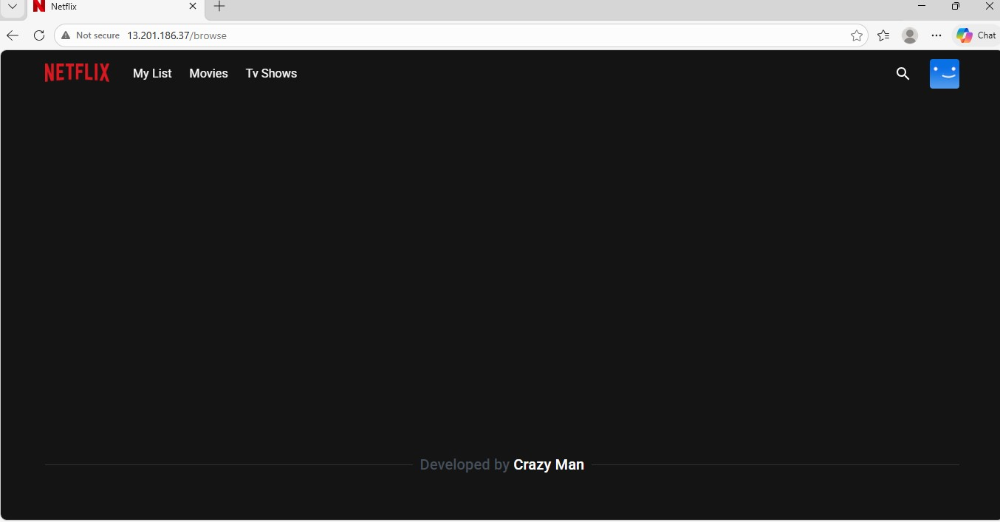

  2. To solve that you have create an **API** key in <b>TMBD</b>
---
###  Step-by-Step Guide

#### **1 Sign Up or Log In**
1. Go to **[TMDB Website](https://www.themoviedb.org/)**.
2. Click on **Sign Up** (if you don’t have an account) or **Log In**.

#### **2 Navigate to API Section**
1. After logging in, click on your **profile icon** (top-right corner).
2. Select **Settings** from the dropdown.
3. In the left sidebar, click on **API**.

#### **3 Request an API Key**
1. Click on **Create API Key**.
2. Select the **purpose**:
   - Personal project
   - Commercial use
   - Educational use
   - Other
3. Fill in the required details.
4. Accept the terms and conditions.
5. Click **Submit**.

#### **4 Get Your API Key**
- Once approved, your **API Key (v3 auth)** will be displayed.
  Now you can build your docker image by using follwing command

```bash
docker image build -t --build-arg  TMDB_V3_API_KEY=6eb0dab847249ae3e2afb0605f4c4e63 -t netflix .
```
 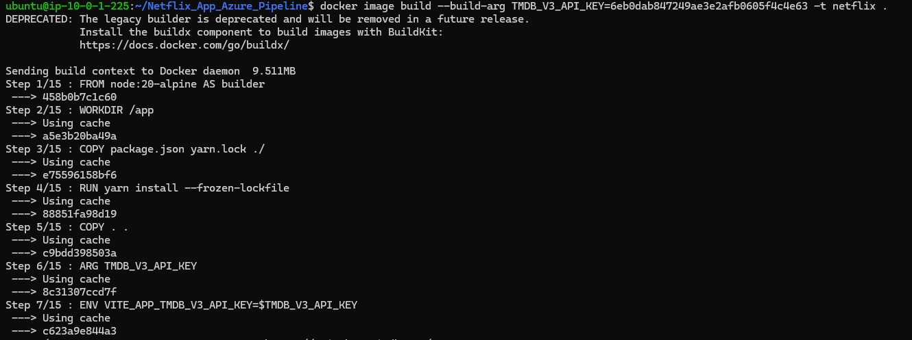
---

## **Step 4: Configure Docker Hub and Azure Resource and Github Credentials in Azure DevOps**
1. Go to **Azure DevOps Dashboard** → **Project Settings** → **Service Connections**
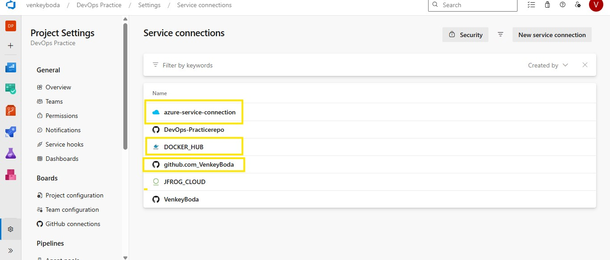

2. Under **Service Connections**, click **New service connection**
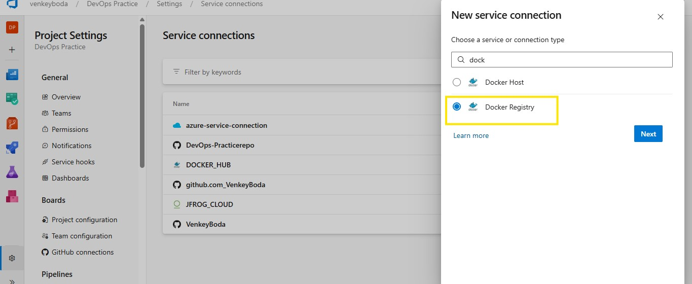

3. Select **Username and Password** and enter:
   - **Username:** *Your Docker Hub username*
   - **Password:** *Your Docker Hub password*
4. Set **ID** as `dockerHub` and save.
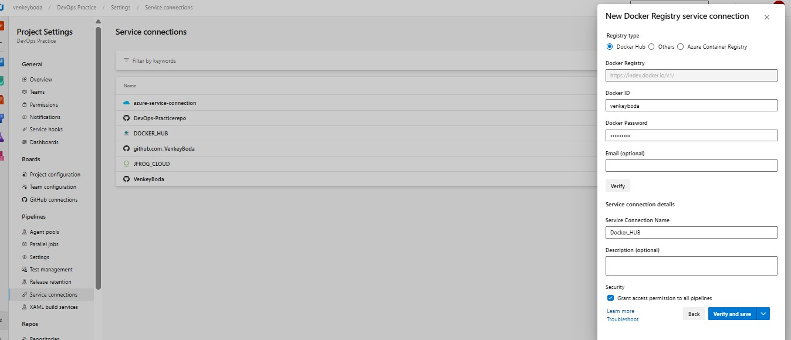

---
## **Step 4: add github repo in Azure DevOps **

### **Step-by-Step Guide**

1. Open **Azure DevOps Dashboard**.
2. Click on **pipelines ---> New Pipwline**.
3. Navigate to **GitHub**.
4. configure to **Your GitHub** credentials
4. Select the **your github repo** tab.
    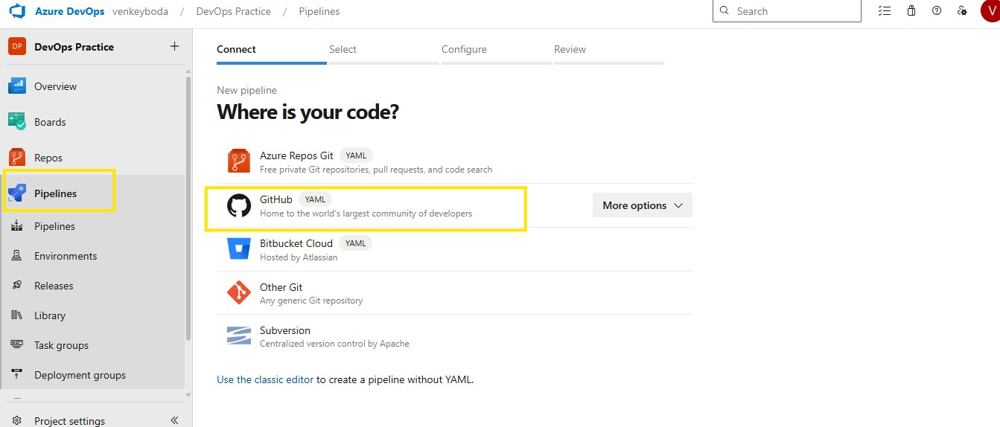
    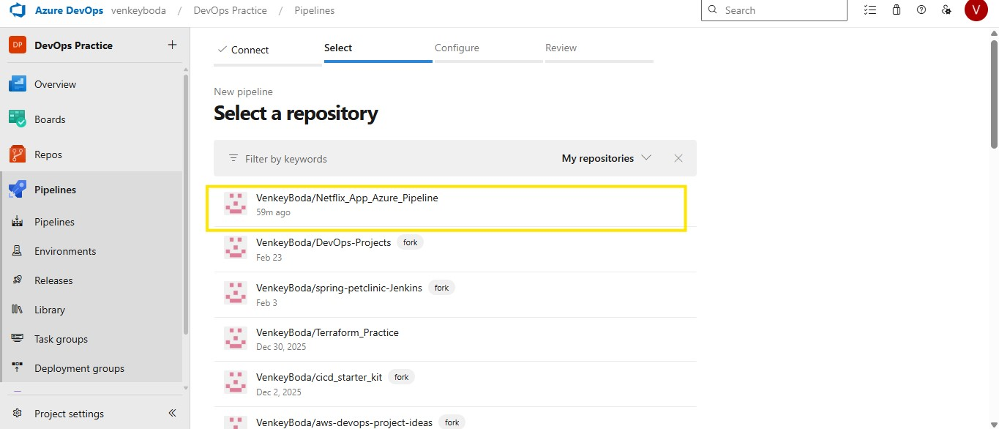

 Now, Azure DevOps is ready for Docker build and push operations! 

## **Step 4: Create a Azure DevOps Pipeline CI stage(Azure-pipeline.yaml)**
Inside your **GitHub repository**, create a file named `azure-pipeline.yaml` with the following content:

```yaml
pool:
  vmImage: 'ubuntu-latest'

trigger:
  branches:
    include:
      - main
  paths:
    include:
      - src/*
      - Dockerfile
      - package.json
      - Infra/*
      - Kubernetes/*

variables:
  dockerimagerepo: 'venkeyboda/netflix'
  dockerImagetag: 'latest'

stages:

# ========================= CI STAGE =========================

- stage: CI
  displayName: "Build & Push Docker Image"
  condition: |
    or(
      contains(variables['Build.SourceVersionMessage'], 'src'),
      contains(variables['Build.SourceVersionMessage'], 'Dockerfile'),
      contains(variables['Build.SourceVersionMessage'], 'package.json')
    )
  jobs:
    - job: build
      displayName: 'Building and testing'

      steps:
        - task: Docker@2
          displayName: 'Build docker image'  
          inputs:
            command: 'build'
            Dockerfile: 'Dockerfile'
            repository: $(dockerimagerepo)
            tags: |
              $(dockerImagetag)
            arguments: |
              --build-arg TMDB_V3_API_KEY=$(TMDB_V3_API_KEY)

        - task: Bash@3
          displayName: 'Trivy Scan'
          inputs:
            filePath: 'Scripts/trivy-scan.sh'
            arguments: '$(dockerimagerepo):$(dockerImagetag)'
            
        - task: Docker@2
          displayName: 'Push docker image'
          inputs:
            command: 'push'
            containerRegistry: 'DOCKER_HUB'
            repository: $(dockerimagerepo)
            tags: |
              $(dockerImagetag)
```

---

## **Step 5: Create a Azure DevOps CI Job**
1. Go to **New pipeline** → Click **GitHub** → Select **Your repository**
2. Under **Your repository**, choose **Existing Azure Pipelines YAML file**
     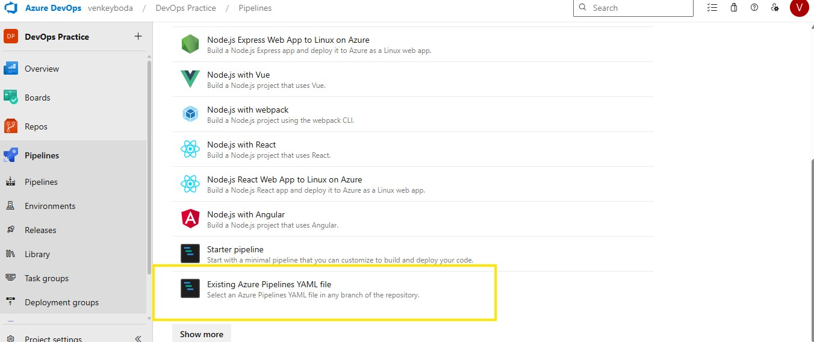
3. Under **Existing Azure Pipelines YAML file**, choose **Branch and Path(Your yaml file)**, click **continue**   
     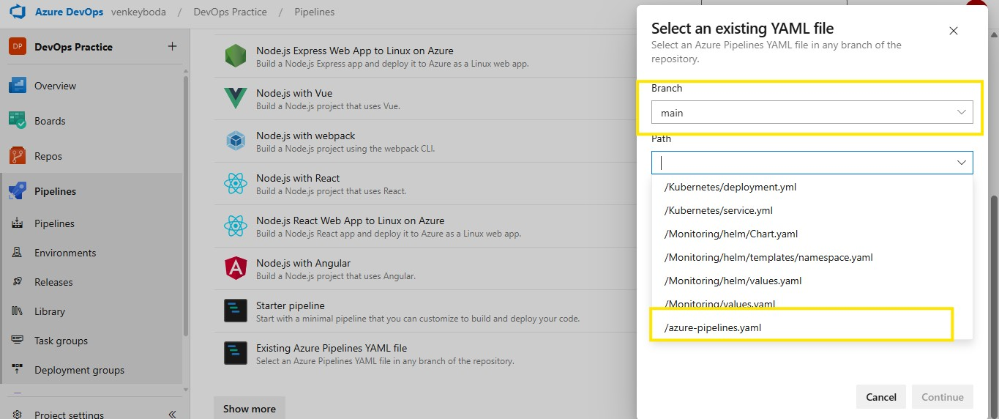
4. Under pipeline add **Varibales**, click **Variables** → Select **New Variable**
     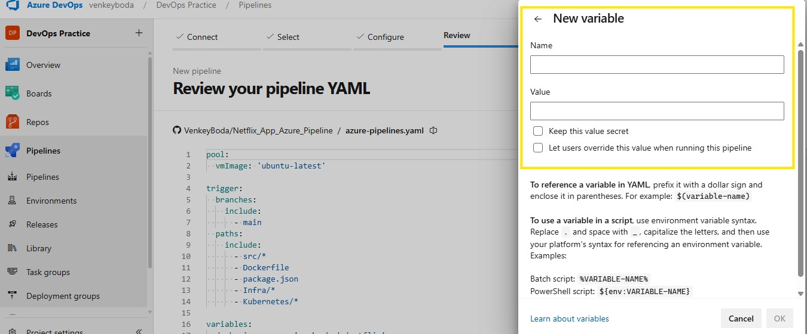
5. add **TMBD Varible Name**, and **Your TMDB API key**, keep secret and click **Run"
     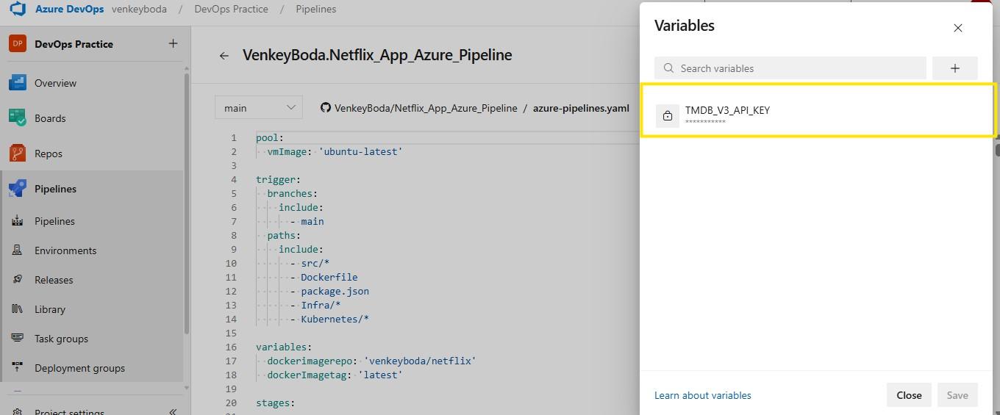
6. Check the Build is successfull or not
    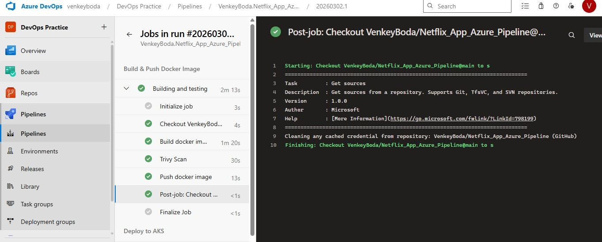
---

## **Step 6: Verify the Docker Image on Docker Hub**
Once the pipeline runs successfully:
1. Go to **Docker Hub** → Navigate to your repository
2. You should see the newly pushed Docker image 🎉
   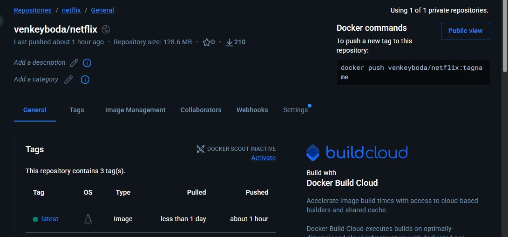

---

## **Bonus: Tagging the Image with Git Commit SHA**
Modify the **Push Image** stage in `azure-pipelines.yaml` to tag images with the Git commit SHA:

```groovy
sh "docker tag ${DOCKER_IMAGE}:latest ${DOCKER_IMAGE}:${GIT_COMMIT}"
sh "docker push ${DOCKER_IMAGE}:${GIT_COMMIT}"
```

## **🚀 What Your CI Stage Does**

```
1️⃣ Build Docker Image

It uses the Azure DevOps Docker@2 task to:
  - Build the Docker image
  - Pass the TMDB API key as a build argument
  - Tag the image as venkeyboda/netflix:latest

Using:
  - Docker

2️⃣ Scan Image Using Trivy

It runs a security scan using:
  - Trivy
This step:
   - Scans OS packages
   - Scans application dependencies
   - Detects known vulnerabilities (CVEs)
   - Improves container security before pushing

3️⃣ Push Image to Docker Hub

If build and scan succeed:
  - The image is pushed to Docker Hub
  - It becomes available for deployment in CD stage
```


## **Step 7: Create an Azure DevOps CD Job (Infrastructure + Deployment + Monitoring)**

1. After the Docker image is successfully pushed to Docker Hub in the CI stage, we now create a CD (Continuous Deployment) stage to:

   - Provision AKS Cluster using Terraform
   - Deploy the Docker image to AKS
   - Expose the application using LoadBalancer
   - Install Prometheus & Grafana for monitoring

## **📂 Repository Structure**

```.
├── Infra/              # Terraform configuration for AKS
├── k8s/                # Kubernetes manifests (Deployment & Service)
├── monitoring/         # Prometheus & Grafana setup
├── Scripts/            # Terraform & deployment scripts
└── azure-pipeline.yaml # CI/CD Pipeline
```

## **Step 7.1: Update azure-pipeline.yaml to Add CD Stage**

```yaml
# ========================= CD STAGE =========================

- stage: CD
  displayName: "Deploy to AKS"
  dependsOn: []
  condition: succeeded()

  jobs:
    - job: Deploy
      displayName: 'Infrastructure + App + Monitoring'
      pool:
        vmImage: 'ubuntu-latest'

      steps:

        - task: CmdLine@2
          displayName: 'Docker Pull'
          inputs:
            script: |
              docker pull $(dockerimagerepo):$(dockerImagetag)
      
        - task: Bash@3
          displayName: 'Install Terraform'
          inputs:
            targetType: 'filePath'
            filePath: 'Scripts/install-terraform.sh'        

        - task: AzureCLI@2
          displayName: 'Terraform Deployment'
          inputs:
            azureSubscription: 'azure-service-connection'
            scriptType: bash
            scriptLocation: scriptPath
            scriptPath: Scripts/terraform.sh

        - task: Bash@3
          displayName: 'Deploy Application'
          inputs:
            filePath: 'Scripts/deploy-app.sh'

        - task: Bash@3
          displayName: 'Install Helm'
          inputs:
            filePath: 'Scripts/install-helm.sh'

        - task: Bash@3
          displayName: 'Deploy Monitoring'
          inputs:
            filePath: 'Monitoring/deploy-monitoring.sh'

        - task: Bash@3
          displayName: 'Trivy Scan'
          inputs:
            filePath: 'Scripts/trivy-scan.sh'
            arguments: '$(dockerimagerepo):$(dockerImagetag)'

        - task: PublishPipelineArtifact@1
          displayName: 'Publish Trivy Report'
          inputs:
            targetPath: 'Security/trivy-report.xml'
            artifact: 'TrivyReport'
```
## **step 8: Check the AKS deployment succussfull or not**

1. first pull the image 
2. created AKS cluster 
3. deploy the application
4. Install Helm and deploy Monitoring
  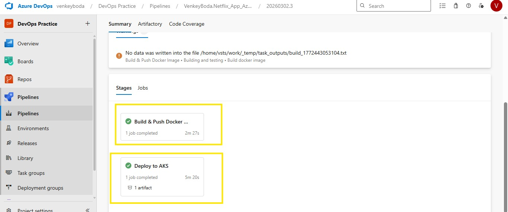

### To see whether the container is running or Not

  1. Go to web-browser and type `http://$EXTERNAL_IP"`
  2. Youll be directed to the Website as follows
  3. 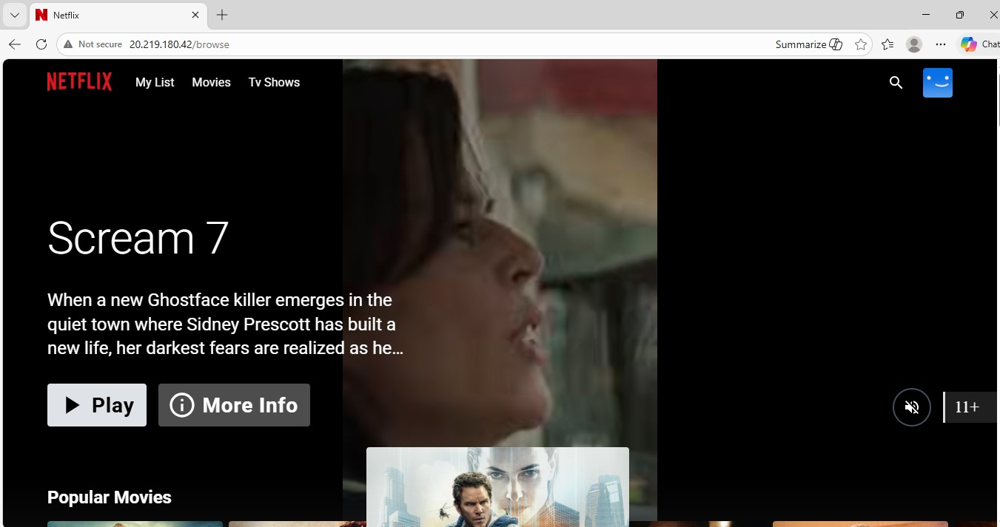

## 🔐 Security Scanning

1. The Docker image is scanned using **Trivy** identify vulnerabilities
2. Publish the trivy report **Security/trivy-report.xml**
    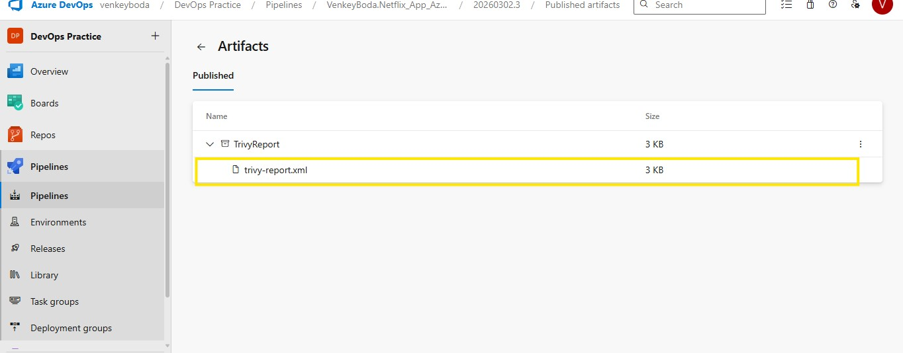

    - Scans OS packages
    - Scans application dependencies
    - Detects known CVEs
    - Ensures secure image deployment

## **Step 9: Login the Monitoring logs**
1. fetching **Grafana Credentials and Promotheous Credentials**, and login
      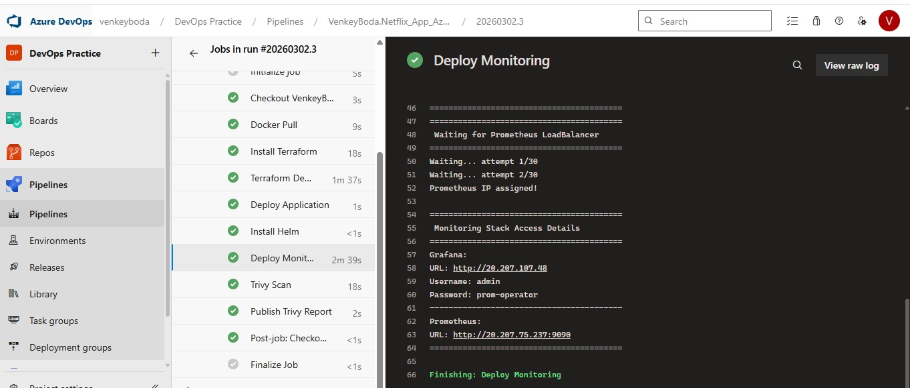

2. check the logs in grafan Dashboard
   - node-1
      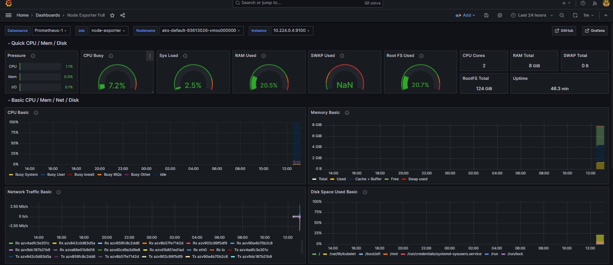
   - node-2 
      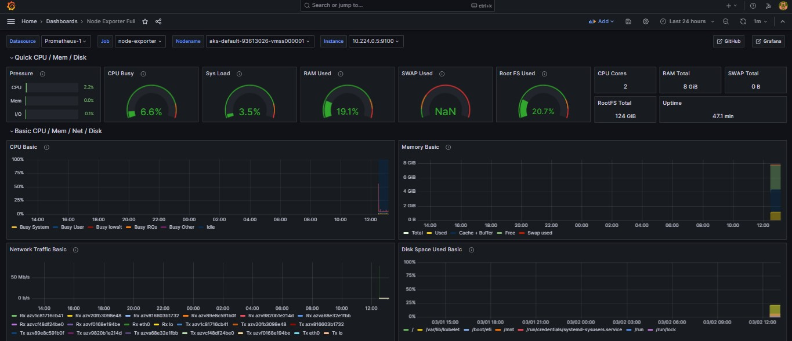         
3. check the image pod info in Promotheous
      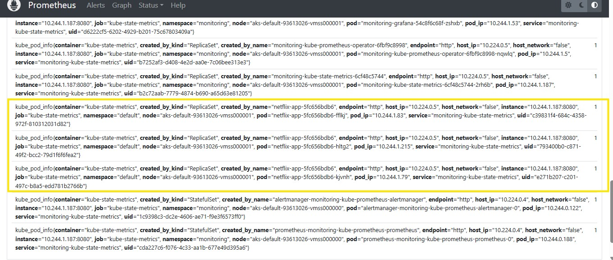

## **Step 10: What This CD Stage Does**

```
1️⃣ Provision Infrastructure

 ### Uses Terraform to create:
  - Resource Group
  - AKS Cluster
  - Node Pool

### Technology used:
  - Terraform
  - Azure Kubernetes Service

2️⃣ Deploy Application to AKS

  - Fetch AKS credentials
  - Apply Kubernetes manifests
  - Pull Docker image from Docker Hub
  - Create LoadBalancer service

### Technology used:

   - Docker
   - Kubernetes

3️⃣ Install Monitoring Stack

### Installs monitoring using Helm:

   - Prometheus
   - Grafana
```

## **Conclusion**
This project demonstrates how to automate Docker image **builds and pushes** using **Azure DevOps pipelines**, improving **DevOps workflows**! 🚀

Happy Learning! 😊
